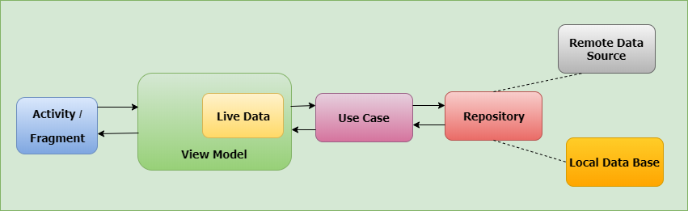
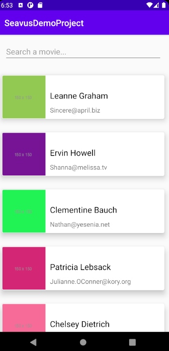
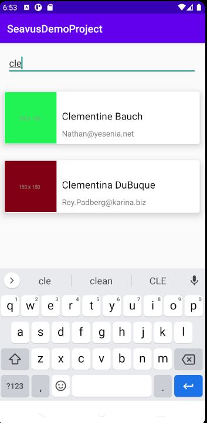
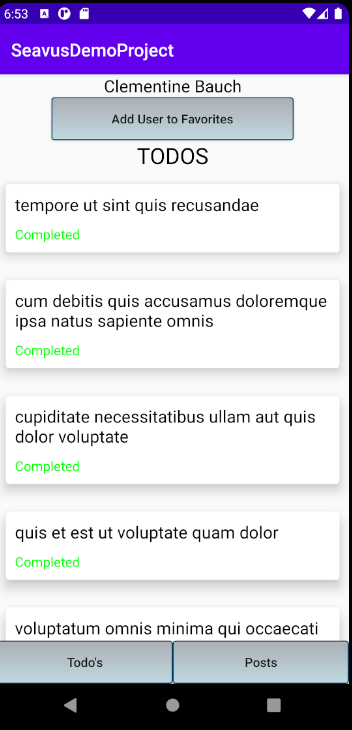
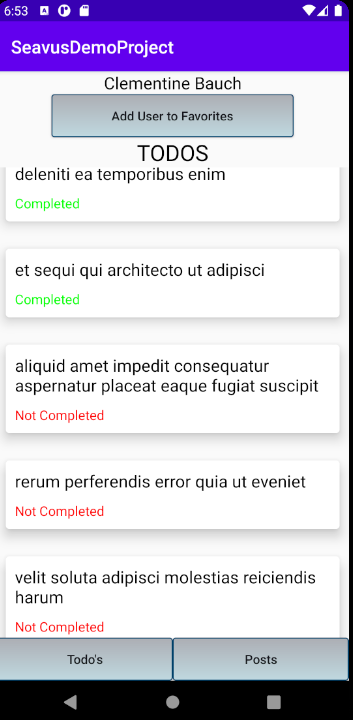
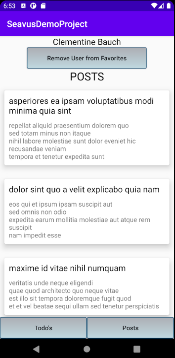

# Seavus Demo Project*
Make an app using Kotlin where you can see all users, search users by their name, users have their pictures (id of user is id of photo located on /photos endpoint), click on them and see their todo-s (sorted, first completed then not completed) you can toggle between seeing todo-s or posts for user.

**Used API**: https://jsonplaceholder.typicode.com/users

# *Followed Architecture*

**Used Concepts**
 - **Coroutines**: A _coroutine_ is a concurrency design pattern that you can use on Android to simplify code that executes asynchronously.
 - **LiveData**: LiveData is an observable data holder class. Unlike a regular observable, LiveData is lifecycle-aware, meaning it respects the lifecycle of other app components, such as activities, fragments, or services.
 - **MVVM**: The ViewModel class is designed to store and manage UI-related data in a lifecycle conscious way. 
 - **Retrofit**: Retrofit is a type-safe REST client for Android, Java and Kotlin developed by Square.
 - **Room**: The Room persistence library provides an abstraction layer over SQLite to allow fluent database access while harnessing the full power of SQLite.
 - **Hilt**: Hilt is a dependency injection library for Android that reduces the boilerplate of doing manual dependency injection in your project.
 - **Navigation:** Navigation refers to the interactions that allow users to navigate across, into, and back out from the different pieces of content within your app.
 - **RecyclerView**: RecyclerView makes it easy to efficiently display large sets of data. You supply the data and define how each item looks, and the RecyclerView library dynamically creates the elements when they're needed.
 - **Glide**: Glide is a fast and efficient open source media management and image loading framework for Android that wraps media decoding, memory and disk caching, and resource pooling into a simple and easy to use interface.

 # *User Catalog*
  ## **Main Page - User List Screen**
 - In this screen, all users which provided by used api, listing. App displaying user name, user email and user photo with card design.
 - 
 
  ## **Main Page - Search Screen**
 - This page also has search functionality by user name.
 - 

  ## **User Detail Page - User Detail Screen**
 - When you click any user in list, you will navigate to detail screen. You can find User Todos and Post in this page.
 - 

  ## **User Detail Page - User Detail Sorted Todos Screen**
 - User Todos sorted, first you will see completeds. After scrolling completed items, you will se incomplete items.
 - 

  ## **User Detail Page - User Posts List Screen**
 - Also this page provide user's Posts. You can switch between user todos and posts.
 - 

   ## **User Detail Page - Add User to Favorites**
 - Users can be add favorites list which storing on local DB. You can add users to favorites list and remove users.
 -  